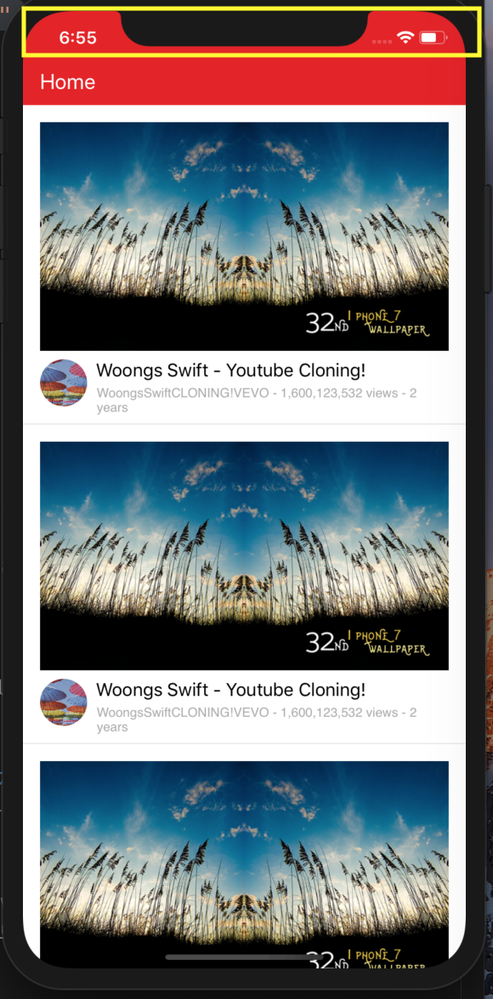

# StatusBar style 바꾸는 방법

앱에서 `statusBar`의 style을 바꾸고 싶은 경우가 있을 것이다.

보통은 default값인 검정글씨 되어있는데 navigationbar의 글씨를 흰색으로 맞춘다던지 하는 경우에 statusBar는 그대로 검은색으로 남아있는 경우를 종종 만나게 된다.

다음 처럼 statusBar의 style을 바꾸려면 어떻게 해야할까?

대표적으로 두 가지 경우가 있다.

1. 앱 전체 모든 statusBar를 바꾸고 싶을 때,
2. 하나 혹은 특정 controller의 statusBar만 바꾸고 싶을 때.

**먼저 앱 전체의 statusBar를 바꿀 경우부터 살펴보자.**

공통적으로 먼저 설정해줘야 할 사항이 있는데, statusBar를 View Controller에서 처리할 지 안할지를 설정해줘야 한다.

이는 `Info.plist`에서 설정해줄 수가 있다.
`Info.plist`에 가서 **_Infomation Property List_**의 **_View controller-based status bar appearance_** 항목을 추가해주고

앱 전체의 statusBar를 바꾸고 싶을 경우이기 때문에 **No**를 선택해준다.

그리고 `AppDelegate.swift` 에서

~~~ swift
func application(_ application: UIApplication, didFinishLaunchingWithOptions launchOptions: [UIApplication.LaunchOptionsKey: Any]?) -> Bool {
        // Override point for customization after 

        UINavigationBar.appearance().barStyle = .blackOpaque
        
        return true
    }
~~~

사실 이전에는 다음과 같은 방법으로 설정해 줄 수 있었는데,

~~~ swift
func application(_ application: UIApplication, didFinishLaunchingWithOptions launchOptions: [UIApplication.LaunchOptionsKey: Any]?) -> Bool {
        // Override point for customization after application launch.
        
        application.statusBarStyle = .lightContent
        
        return true
    }
~~~

iOS9이상부터는 다음 방법이 **deprecated** 되었고 각 컨트롤러에서 설정해줄 것을 권장하고 있다. 

**다음으로 특정 컨트롤러의 statusBar를 바꿀 경우를 살펴보자.**

이번에는 앞의 경우와는 반대로 애플에서 권장하는 각 컨트롤러에서 statusBar를 설정하는 방법을 알아보자. 
각 컨트롤러에서 statusBar를 설정할 것이기 때문에, 

`Info.plist`에 가서 **_Infomation Property List_**의 **_View controller-based status bar appearance_** 항목을 추가해주고 **Yes**를 선택해준다.

그리고 해당 컨트롤러에 가서 

~~~ swift
override var preferredStatusBarStyle: UIStatusBarStyle {
        return UIStatusBarStyle.lightContent // .default
    }
~~~

다음과 같이 설정하면 된다.