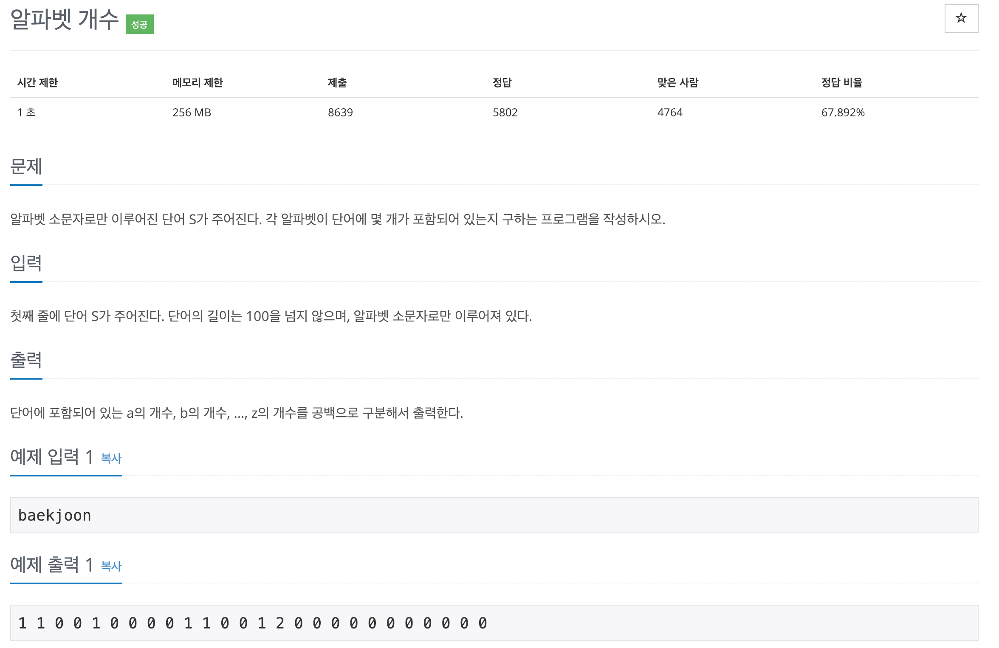

# 백준 (BOJ) 10808 풀이

간단한 문제이기 때문에 여러 방법이 있겠지만, 필자는 알파벳 순으로 0~25의 배열에서 해당 알파벳의 인덱스를 +1 시켜주는 방법을 사용해 해결했다. 

- 우선 알파벳으로 이루어진 alpabet array와 개수를 카운트 할 0~25까지의 빈 count array 를 만든다.
- 입력받은 단어를 한 글자씩 알파벳 배열의 몇 번째 인덱스에 해당하는지 찾는다.
- count array의 해당 인덱스를 +1 시켜준다.

문제는 방법이 아니라 **어떻게** 구현할 것인가였다. 
과거에는 `find()` 함수를 사용해 해결할 수 있었지만, 현재는 없어졌고 array의 index를 찾는 함수를 사용해 해결하였다.

어렵지 않은 문제이기 때문에 바로 코드를 보면 이해할 수 있을 것이다.

~~~ swift
var countArray: [Int] = [Int](repeating: 0, count: 26)
var alphabetArray = Array("abcdefghijklmnopqrstuvwxyz")

if let word = readLine(){
    
    for value in word {
        let idx = alphabetArray.firstIndex(of: value) ?? 0
        countArray[idx] += 1
    }
    
    for value in countArray {
        print(value, terminator:" ")
    }
}

~~~

Swift문법에 익숙하지 않으면, alpabetArray를 만드는 방법과, 출력을 [줄바꿈 없이 띄어쓰기를 사용해 나타내는 방법]()을 몰라 고민할 수 있을 것 같다.
