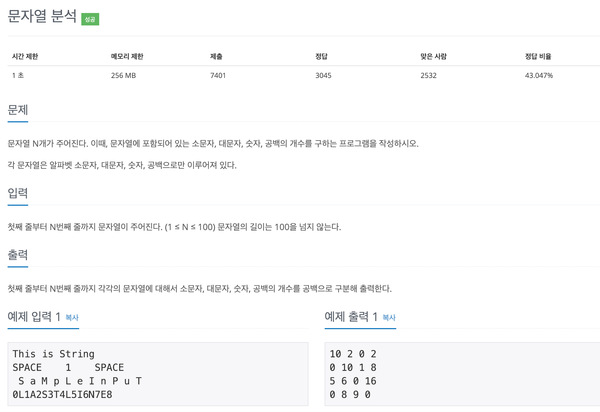

# 백준 (BOJ) 10808 문자열 분석

이 문제는 입력의 개수가 정해져 있지 않아서 상당히 애를 먹었던 문제이다. 아니 입력개수를 알려줘야 반복문을 돌리지....?

문제 자체는 스위프트에서 Character를 a~z 순으로 비교할 수 있어서 간단히 해결할 수 있기 때문에, **입력개수가 정해져 있지 않을 때** 어떻게 해결해야 하는지에 초점을 맞춰보도록 하겠다.

우선 **출력초과**를 맞으며 틀렸던 처음의 코드를 보자.

~~~ swift
// 출력초과
while true {
    let input = readLine() ?? ""
    let str = Array(input)
        var underStr = 0
        var upperStr = 0
        var number = 0
        var space = 0

    for i in 0..<str.count {
        if str[i] == " " {
            space += 1
        } else if str[i] >= "a" && str[i] <= "z" {
            underStr += 1
        } else if str[i] >= "A" && str[i] <= "Z" {
            upperStr += 1
        } else {
            number += 1
        }
    }

    print("\(underStr) \(upperStr) \(number) \(space)")
}
~~~

c나 c++ 에서 while (1)로 하듯이 while문을 일단 true로 하고 반복해서 해결하면 될 줄 알았으나 저런식으로 하면 될 줄 알았으나, 실제로 저 상태에서 `Control + D`를 눌러서 강제종료를 시키면 종료가 되지 않고 **nil**이 무한반복되어 버린다. 

> 확실하지는 않지만 c나 c++에서는 강제종료시에 -1을 return해서 종료가 되지만 swift에서는 **nil**을 반환하기 때문에 그런 것이 아닐까.. 지극히 개인적인 생각이니 틀렸다면 따끔히 지적해주시면 너무 감사하겠습니다.

아무튼 저런식으로는 해결할 수 없다는 걸 확인했다 !! 그럼 문제에서 n 이 100보다 작거나 같다고 했으니 count변수 같은 것을 만들어서 100보다 작게 한다면...? 일단 내 코드에서는 그냥 넘어가는 것이 아니라 0으로 초기화된 변수들을 출력해버리기 때문에 _오답_처리가 되어버린다. 

그렇다면 우리의 친구 guard문이나 if let을 사용하는 것은? 우선 if 문을 사용하면 readLine()의 `String?` 타입을 String으로 캐스팅 해주지 않으면 Array를 만들어 사용할 수가 없다. 
guard는 `Return invalid outside of a func` 다음과 같은 에러가 보여주듯이 return은 함수가 아니면 사용할 수 없다..

>그래서

원하는대로 함수안에서 사용해 주기로 했다. 
결과는 `성공!!` 그래서 guard문을 사용해 수정한 코드는 다음과 같다.

~~~ swift
// 함수를 호출해 guard문 사용
func main() {
    while true {
        guard let input = readLine() else { return }
        let str = Array(input)
            var underStr = 0
            var upperStr = 0
            var number = 0
            var space = 0

        for i in 0..<str.count {
            if str[i] == " " {
                space += 1
            } else if str[i] >= "a" && str[i] <= "z" {
                underStr += 1
            } else if str[i] >= "A" && str[i] <= "Z" {
                upperStr += 1
            } else {
                number += 1
            }
        }

        print("\(underStr) \(upperStr) \(number) \(space)")
    }
}

main()
~~~

하지만 이렇게 하지 않고도 while에서 바로 readLine()을 받는다면 c나 c++처럼 사용할 수 있다. 

~~~ swift
// 
while let input = readLine() {

    let str = Array(input)
    var underStr = 0
    var upperStr = 0
    var number = 0
    var space = 0
    
    for i in 0..<str.count {
        if str[i] == " " {
            space += 1
        } else if str[i] >= "a" && str[i] <= "z" {
            underStr += 1
        } else if str[i] >= "A" && str[i] <= "Z" {
            upperStr += 1
        } else {
            number += 1
        }
    }

    print("\(underStr) \(upperStr) \(number) \(space)")
}
~~~

>while에서 바로 입력을 받는 방법은 전에 풀었던 문제에서도 한번 봤었던 방법인데 그 문제를 찾을 수가 없어 꽤 헤맸다. 역시 문제는 제대로 정리를 해두어야 추후에 고생을 덜 하는 것 같다. 오늘도 반성의 시간~