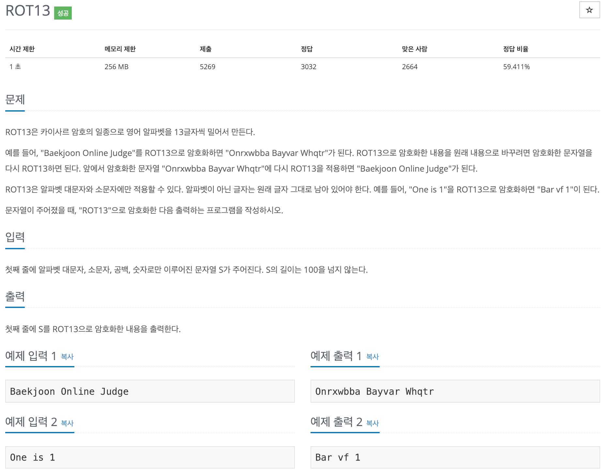

# 백준 (BOJ) 10808 ROT13

보안시간에 배웠던 카이사르의 이름을 따서 만든 시저암호에 대한 문제이다. 각 문자마다 특정 칸 만큼 이동시켜 만드는 암호문이다. ROT13은 시저 암호의 일종으로 13칸씩 이동시켜 26글자인 알파벳의 경우 두 번 적용하면 원래의 글자가 나오는 암호화와 복호화가 같은 암호화 방법이다. 

사설은 이쯤하고 그래서 우리는 문제를 어떻게 해결해야 할 지 생각해보자. 

사실 문제의 설명에서 답은 나와있다. 13칸씩 이동시키면 된다!! 이때 우리가 흔히 사용하는 ASCii 코드를 이용해서 풀면 되겠다.

근데 Swift에서는 아스키 코드를 어떻게 사용해야 하지...?

ASCII코드와 Unicode의 차이는 뭔지 어떻게 쓰는지 잘 모르겠다면 앞서 [정리해둔 글을 참고하자]().

아스키 코드로 A~Z는 65~90, a~z는 97~122 이기 때문에 우선 해당 문자가 아스키 코드인지 확인한 후 알파벳에 해당한다면 13을 더해 주고 더해서 해당 범위를 넘어선다면 % 를 사용하였다.

~~~swift
extension Character {
    var isAscii: Bool {
        return unicodeScalars.first?.isASCII == true
    }
    var ascii: UInt32? {
        return isAscii ? unicodeScalars.first?.value : nil
    }
}

if let str = readLine() {

    var newUInts: [UInt32] = []
    var newStrs = ""

    for c in str {
        if let uni = c.ascii {
            if uni >= 97 && uni <= 122 {
                let newUni = uni + 13
                newUInts.append(newUni > 122 ? 97 + (newUni % 123) : newUni)
            } else if uni >= 65 && uni <= 90 {
                let newUni = uni + 13
                newUInts.append(newUni > 90 ? 65 + (newUni % 91) : newUni)
            } else {
                newUInts.append(uni)
            }
        }
    }

    for i in newUInts {
        if let str = UnicodeScalar(i) {
            newStrs += String(str)
        }
    }

    print(newStrs)
}
~~~

>더 간단하게 하는 방법이 있을 것 같은데.. swift로 이 문제를 푼 사람은 아직 나뿐이라서 아직은 잘 모르겠다. 추후 공부하고 성장해서 지금 이 글을 다시보면 부끄러워질 날이 오길...
